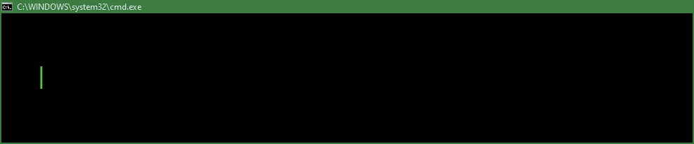

Фронтенд разработчик.
## 🛠 Стек используемых технологий:

- **Языки программирования/разметки/стилей:** 
    
    
    
    
    
    
- **Фреймворки:**
    
- **Инструменты сборки:** 
    
    
- **Форматеры и линтеры:**
    
    
    
- **Тестирование:**
    
    
- **Менеджер пакетов:** 
    
    
- **Инструменты и технологии:** 
    
    
    
    
    
